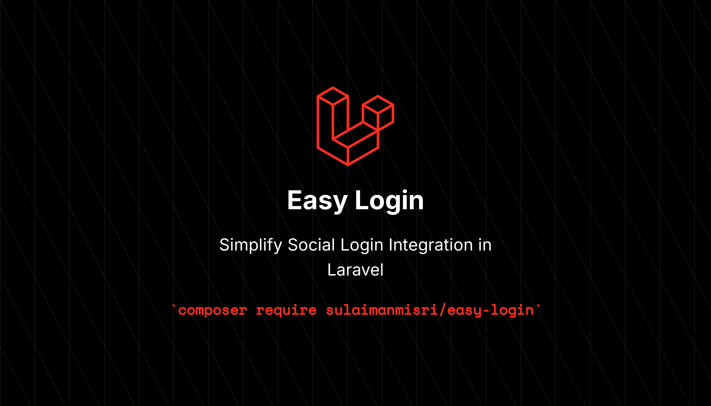

## Easy Login for Laravel Application
Easy Login is a Laravel package designed to simplify OAuth authentication using Laravel Socialite. It provides pre-built success/failed mechanism, routes and streamlined configuration to integrate third-party OAuth providers effortlessly.

## Installation
> [!IMPORTANT]
> Before you install this package, you need to install Laravel Socialite first. Read the [Laravel Socialite Documentation](https://laravel.com/docs/master/socialite)

1. Install the package via Composer
```bash
composer require sulaimanmisri/easy-login
```

2. Publish the configuration file:
```bash
php artisan vendor:publish --tag=easy-login-config
```

3. Configure your OAuth credentials in .env. Example:
```env
GITHUB_CLIENT_ID=your-client-id
GITHUB_CLIENT_SECRET=your-client-secret
GITHUB_REDIRECT_URL=https://your-app.com/auth/{provider}/callback
```

> [!IMPORTANT]
> You should only change the {provider} name to the specific provider that you choose. For example, if you choose `Facebook`, then your Redirect URL should be: `/auth/facebook/callback`

That's it for the installation.

## Usage
You can modify the post-login redirect paths in the `config/easy-login.php` file:
```
'redirects' => [
    'success' => '/dashboard',
    'failure' => '/login',
]
```

After you finish the installation and modify the `easy-login` config, you can use the pre-defined route in your own `html button`. Like this :
```blade
<a href="{{ route('easy-login.github') }}"> Login via Github </a>
```

or

```blade
<a href="{{ route('easy-login.azure') }}"> Login via Azure </a>
```


#### List of pre-defined Route Names
* easy-login.github
* easy-login.google
* easy-login.facebook
* easy-login.twitter
* easy-login.azure
* More to coming!

## Auth Session
This package comes with Success and Failed login mechanisms. When a user tries to login via any selected Social Login and their email is not found in your DB, they will be redirected to the path set in the config, where you can display a custom message.

You can change the Success and Failed Messages by modifying the error value inside the `config/easy-login.php` file:

* For Success session, use `easy-success` as the key
* For Failed session, use `easy-error` as the key

Example:
```
@if (session()->has('easy-error'))
    <div class="border-2 border-red-500 bg-red-100 rounded-lg py-2 px-4">
        <p class="text-red-500 text-center">
            {{ session('easy-error') }}
        </p>
    </div>
@endif
```

## Key Features
#### 1. Seamless Integration with Laravel Socialite
Easily connect your application to providers like GitHub, Google, and more through Laravel Socialite.

#### 2. Simple Configuration
Manage OAuth providers in a single configuration file.

#### 3. Pre-Built Routes
Automatically provides routes for:
* Redirecting to OAuth providers (e.g., GitHub)
* Handling authentication callbacks

#### 4. Customizable Behavior
Extend or override the config data or callback logic easily using the CallbackServices class.

## Customization
If you need to customize the behavior (e.g., mapping user data or handling errors), use the `CallbackServices` class provided by the package. Extend the class to implement custom logic for:
* Handling user data retrieval
* Stopping execution if a user does not exist

## Contributing
Feel free to contribute to this package by submitting issues or pull requests. Follow the standard coding guidelines for consistency.

